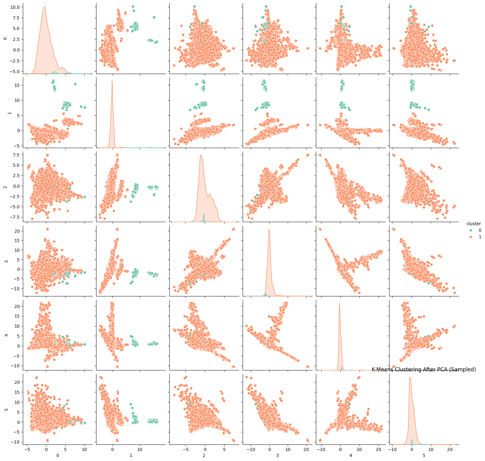

# CSE151A_Group_Project_SII25
The data and code for the CSE151A group project

# SETUP

Data for the project was obtained from [kaggle](https://www.kaggle.com/datasets/sherrytp/airline-delay-analysis). A kaggle account with API key is required. It must be downloaded and unzipped into Colab Notebook session.


# Submission 2 questions
**1. How many observations does your dataset have?**

 For simplicity, we will only look at airline delay info for the year 2018, which has exactly 7,213,446 observations.
 
**2. Describe all columns in your dataset their scales and data distributions. Describe the categorical and continuous variables in your dataset. Describe your target column and if you are using images plot some example classes of the images.**

 _FL_DATE_ : date. Distribution: flat distribution.

_OP_CARRIER_ : airline code (category). Distribution: some airlines show up more often.

_OP_CARRIER_FL_NUM_ : flight number (category). Distribution: some flight numbers show up the most.

_ORIGIN_ : origin airport code (category). Distribution: 90% unique airport codes.

_DEST_ : destination airport code (category). Distribution: 90% mostly unique.

_CRS_DEP_TIME_ : scheduled departure time (continuous). Distribution: most popular departure times are either morning or afternoon.

_DEP_TIME_ : actual departure time (continuous). Distribution: extremely inconsistent pattern.

_DEP_DELAY_ : minutes late/early at departure (continuous). Distribution: Most flights depart early.

_TAXI_OUT_ : minutes from gate pushback to takeoff (continuous). Distribution: Most flights have values 8-16 minutes.

_WHEELS_OFF_ : takeoff time (continuous). Distribution: extremely inconsistent pattern.

_WHEELS_ON_ : touchdown time (continuous). Distribution: extremely inconsistent pattern.

_TAXI_IN_ : minutes from touchdown to gate (continuous). Distribution: Minutes are mostly within 1-6

_CRS_ARR_TIME_ : scheduled arrival time (continuous). Distribution: extremely inconsistent pattern

_ARR_TIME_ : actual arrival time (continuous). Distribution: extremely inconsistent pattern

_ARR_DELAY_ : minutes late/early at the arrival gate (continuous). Distribution: Delays mostly range between ~50 minutes late to 1 hour early

_CANCELLED_ : 0/1 (category). Distribution: less than 2% are cancelled

_CANCELLATION_CODE_ : reason A/B/C/D (category and only for cancelled). Distribution: 98% empty values

_DIVERTED_ : 0/1 (category). Distribution: less than 1% flights diverted

_CRS_ELAPSED_TIME_ : planned gate-to-gate minutes (continuous). Distribution: Most values range roughly between 1 to 2 hours

_ACTUAL_ELAPSED_TIME_ : actual gate-to-gate minutes (continuous). Distribution: Most values also roughly range between 1 to 2 hours

_AIR_TIME_ : minutes in the air (continuous). Distribution: Most flights in the air range between 40 minutes to 1.5 hours

_DISTANCE_ : miles between airports (continuous). Distribution: most flights travel on average 800 miles

_CARRIER_DELAY_ : minutes attributed to airline (continuous). Distribution: Average time is 20 minutes

_WEATHER_DELAY_ : minutes due to weather (continuous). Distribution: Average time is 3.64 minutes

_NAS_DELAY_ : minutes due to airspace/ATC/volume (continuous). Distribution: Average time is 15.9 minutes

_SECURITY_DELAY_ : minutes due to security (continuous). Distribution: Average time is 0.09 minutes

_LATE_AIRCRAFT_DELAY_ : minutes due to late inbound plane (continuous). Distribution: Average time is 25.6 minutes

_Target Column: ARR_DELAY (Arrival delay)_
Our dataset only contains numerical data and no images.

**3. Do you have missing and duplicate values in your dataset?**

 There is a significant number of missing data. This includes some of the feature columns we deem crucial to our target.

**4. Note: For image data you can still describe your data by the number of classes, size of images, are sizes uniform? Do they need to be cropped? normalized? etc.**

Some columns are categorical data, including date/time, that will require encoding. The target feature will have to be normalized.

**6. How will you preprocess your data? Handle data imbalance if needed. You should only explain (do not perform pre-processing as that is in MS3) this in your README.md file and link your Jupyter notebook to it. All code and  Jupyter notebooks have be uploaded to your repo.**

Some of the columns in the raw data will be dropped since they are irrelevant or redundant to the purpose of the model.
Missing data will be replaced with synthetic data computed from information available, if not possible to compute those values, they will be replaced with zeros. Categorical and date/time data will be encoded. Since this is a regression model, we do not anticipate significant issues with data imbalances, but we have enough data points to be able to drop rows for balancing purposes if necessary.

**7. You must also include in your Jupyter Notebook, a link for data download and environment setup requirements**

# Milestone 3 questions
**1. Where does your model fit in the fitting graph? (Build at least one model with different hyperparameters and check for over/underfitting, pick the best model).**

We ran two SVR models with different hyperparameters:

model 1: 
```SVR(kernel='linear', C=5, epsilon=0.001)```

model 2: 
```SVR(kernel='linear', C=50, epsilon=0.1)```

Both models achieve high training and testing $R^2$ of ~0.92 with small differences. This shows that the models are not underfitting since the variance explained is high. It also shows no overfitting since the test performance is very close to training performance of the models.


Between the two models, model 2 with higher (stricter) C parameter and the looser epsilon has slightly higher performance on the test data, while not super significant, we could say it is the better model.

 
**2.What are the next models you are thinking of and why?**

The most obvious model to try on this data would be decision tree based models. Our dataset has a mixed data types, categorical features such as ORIGIN, DEST, OP_CARRIER and numerical features such as DISTANCE, CRS_DEPART_TIME, etc. Decision trees are good at mixing numerical values with thresholds and categorical values.

Most importantly decision trees could allow us to capture possible non-linear relationships which could be valuable in our analysis because flight delays can be influenced by combinations of factors. Perhaps specifically flights from LAX on weekends are often delayed, SVR captures linear relationships but a decision tree could model non-linear and combinations of factors more effectively.

**3. Conclusion section: What is the conclusion of your first model? What can be done to possibly improve it?**

Our first SVR model achieved high performance (Train $R^2 \approx 0.92$ and Test $R^2 \approx 0.93$) so the model is quite accurate and is not overfitting or underfitting. This means that the flight delay outcome can be predicted quite accurately using the features in our dataset such as origin, distance, carrier, etc.

To further improve the model we could try the following:
- Train on more of the dataset (more computationally intensive)
- Tune the hyperparameters using cross-validation to dial in optimal C, epislon, and Kernel choice.
- Add more features such as weather at origin and destination, whether certain dates are holidays
- Try non-SVR models such as decision trees as previously mentioned

# CSE 151A Final Project

### 0.1. Intro: Why was it chosen? Why is it cool? Discuss the general/broader impact of having a good predictive mode. i.e. why is this important? (3 points)

Flight delays frequently spoil travel plans for even the savviest of flyers. Late landings, inclement weather, and other emergencies are inevitable. Itineraries that accurately account for delays stand to ease a major pain point for travelers on commercial airlines. Our project seeks to address this problem by predicting the length of flight delays using machine learning. 

Your report should include relevant figures of your choosing to help with the narration of your story, including legends (similar to a scientific paper). For reference you search machine learning and your model in google scholar for reference examples. (3 points)

### 0.2. Methods

#### 0.2.1. Data Exploration

For the exploratory data analysis section, we began by examining the overall structure and contents of the flights dataset. We inspected the number of rows and columns, the data types of each feature, and generated descriptive statistics for both numerical and categorical variables.

We checked for duplicates, empty cells, missing data using pandas methods such as:
```
df.isnull().sum()
df.duplicated().sum()
```


We ran some exploratory visualizations on the data including a heatmap on the numerical columns with the following code. ```sns.heatmap(feature_df[numerical_cols],
            annot=True,
            linewidth=.5,
            cmap = sns.color_palette("magma", as_cmap=True)```


Finally, we used generated a Seaborn pairplot on some explanatory features.
```sns.pairplot(pd.concat(concatenated_df[features], target_df))```

#### 0.2.2. Preprocessing Steps

Our dataset, which initially contained about 7,000,000 rows of data, was sampled down to about 500,000 rows using pandas' `Dataframe.sample(frac=0.07, random_state=42)`.

Missing values were imputed with different methods for categorical and numerical features. For numerical features, missing values were replaced with the mean. 

"OP_CARRIER", "ORIGIN", and "DEST" were treated as categorical variables. Their missing values were replaced with the mode. 1-hot encodings of these variables were generated using `pandas.get_dummies()`. These encodings replaced the original categorical features in the dataframe. 

Time-related features, such as "FL_DATE" and "CRS_DEP_TIME" were encoded cyclically as $\sin(\frac{2\pi x}{\max(X)})$ . 

Once encoded, all features were z-scored. 

*Note: A methods section does not include any why. the reason why will be in the discussion section. This is just a summary of your methods (5 points)*

#### 0.2.3. Model 1

Our first model used SciKitLearn's Support Vector Regression with a linear kernel. Its training data consisted of a limited subset of features including "FL_DATE", "CRS_DEP_TIME", "DEP_DELAY", "DISTANCE", and "CRS_ELAPSED_TIME."

We attempted two variations on this. In the first, our regularization parameter `C` was set to 5. The `epsilon` parameter was set to 0.001, meaning that our model was not penalized for predictions within this radius of ground truth training data. 

The second variation followed the same SVR approach with modified parameters. It used weaker regularization (`C=50`), while setting a more forgiving `epsilon` value of 0.1. 

#### 0.2.4. Model 2

Our second model used dimensional reduction and clustering techniques to enhance the predictions of a Support Vector Classifier. 

It first entailed applying Principal Component Analysis to a DataFrame containing the same subset of features used to train Model 1. We sought to extract 6 principal components using SciKitLearn's PCA implementation. We used the `fit_transform` method, which trains the model and returns a dimensional reduction of training data. 

SciKitLearn's KMeans implementation was applied to this dimensional reduction to identify 2 clusters. The `n-init` parameter was set to 10 in order to compare and select the optimal output from 10 sets of initial centroids. SciKitLearn bases this comparison on inertia. The algorithm parameter was also set to `elkan`. 

### 0.3. Results: This will include the results from the methods listed above (C). You will have figures here about your results as well. No exploration of results is done here. This is mainly just a summary of your results. The sub-sections will be the same as the sections in your methods section. (5 points)

#### 0.3.1. Data Exploration

Our exploratory data analysis revealed a broad dataset, including many airlines traveling all distances at all times of day from many cities of origin. 

Distinct carriers showed some of the more marked differences. A few were outliers in terms of both delay and spread of flight dates. There were also large differences in popularity between airlines as proportion of flights. 

Similarly, flights from a subset of origins and destinations had significantly longer flight times and distances than all others.

Distance had a slight positive correlation with departure delay, and a negative one with arrival delay. 

All in all, various features of the dataset showed interesting relationships, but none appeared very influential on arrival delay, our variable of interest.

#### 0.3.2. Preprocessing Steps

#### 0.3.3. Model 1
Both variations of our SVR-based model implementation were evaluated using mean squared error (MSE) and R-squared. For clarity, this section and the subsequent one round all values of evaluation metrics to 4 decimal places. 

The first variation (C=5, epsilon=0.001) yielded a training MSE of 0.0804 and a testing MSE of about 0.0709. This model's training value of r-squared was 0.9196. On testing data, r-squared was about 0.9291. 

The second variation (C=50, epsilon=0.1) had a MSE of 0.0799 on its training data. On testing data, this model's MSE was close to 0.0703. Training r-squared was 0.9201, and testing r-squared was 0.9297. 

#### 0.3.4. Model 2
Our unsupervised learning model was evaluated on 500,000 data points using silhouette score for K-Means clusters, and mean accuracy for our linear Support Vector Classifier's final output. 

Silhouette score was calculated using 500,000 data and cluster label pairs. These clusters resulting from applying K-means to our principal components achieved a Silhouette Score of 0.7147. Our cluster visualizations, shown below, plot a random subset of 100,000 cluster-label pairs. 



Our linear support vector classifier achieved accuracy values of 1.0 for both training and test data. For predictions on test data, there were 97,939 true positives and 1,167 true negatives. 

### 0.4. Discussion

#### 0.4.1. Data Exploration

At first glance, our features did not display a clear correlation with flight delay. 

Although distance was found to be correlated with both arrival and departure delay, these correlations were small and in contradictory directions. As such, they are unlikely to be meaningful to our overall analysis. 

The relationships between features were largely explainable by air travel regulations and the general landscape of the commercial flight industry. 

For example, carriers were differentiated by the spread of dates when flights were offered. Without closer investigation, it seems reasonable to conclude that these differences are explainable by the business size of each carrier. Large airlines operating in the United States generally offer flights year-round. By contrast, regional carriers operating smaller aircraft are more limited by seasonal weather changes.  

Likewise, variation in the proportion of flights overseen by different carriers seems to be a natural result of market share differences. 

Furthermore, variations in flight distance and durations by origin and destination city are likely due to the designation of international airports. 

Despite this, our initial data exploration phase influenced our model choices, particularly as we learned additional model types throughout the class.
#### 0.4.2. Model 1 

Informed by our data exploration and visualization, we first decided to use a regression type classification model (SVR) on our dataset. The SVR training resulted in a very strong model. However, we found we were likely not getting enough information out of the categorical data. Furthermore, we found the SVR model to be very computationally expensive. As a result, we had to limit the size of our training dataset, harming the accuracy of the model. Furthermore, the very high r-squared value (approx. 0.93) suggests that some training features could be overly correlated with the output variable. For example, departure delay (DEP_DELAY) is directly linearly related to our target feature arrival delay (ARR_DELAY). If one feature has so much explanatory power, our SVR model may assign it excessive weight. 

#### 0.4.3 Model 2

For our next model, we wanted to explore using some unsupervised clustering approaches to mitigate this issue with our SVR model . The unsupervised model is better suited to the numerous categorical features in our dataset ,such as airline and destination. Furthermore, we wanted to increase our training dataset size to 500,000 rows We decided to use K-Means clustering on the dataset after dimensionality reduction with PCA. Doing PCA before K-Means reduced the computational cost of training the mode, enabling us to use more data. To evaluate the separation of these clusters, a Support Vector Machine (SVM) was trained using the K-Means cluster assignments as labels. The resulting confusion matrix showed no false positives or false negatives which simply tells us that the SVM was able to exactly replicate the K-Means cluster assignments on the test set, suggesting that the clusters were linearly separable in the PCA-reduced feature space. This does not necessarily mean that the model perfectly predicts flight delays. Furthermore, the confusion matrix also revealed an imbalance between the two clusters, with one cluster containing substantially more data points than the other. This imbalance may reduce the interpretability and practical value of the clusters, as one group dominates the classification.

### 0.5.  Conclusion

All of our models performed well on both training and testing data. Our linear SVR models performed better than random guessing, with similarly reasonable test MSEs. Although a skew towards positive predictions may indicate feature imbalance, our unsupervised Support Vector Machine flawlessly replicated the K-Means cluster classification of the test set.

Given the accuracy of these models, the primary limitations of our project are model interpretability and presentation. 

As we did not generate PCA loadings, it is unclear which features provided the most explanatory value. 

Our insights were further constrained by limited attention to data visualization throughout the project. Our data visualizations tended to be crowded, poorly formatted, and unsuited to categorical data. In addition to isolating our data from its practical meaning, this is unsightly for readers. Had we rendered additional visualizations of our results, we may have been able to theorize about their contextual interpretations.

### 0.6. Statements of Contribution 

Jason Bulux: team leader, also contributed to meeting planning, ran notebook via SDSC, optimized cell blocks to improve kernel execution time, and helped giving feedback to writeups.

Samuel Kogan: 
I joined the project after the first week, I was lucky to be welcomed by this hard working team. Contributed on visualization, some discussion but mostly writeups.

Rosario Ortiz: contributed to meeting planning and note-taking, data preprocessing, data visualization and final writeup

